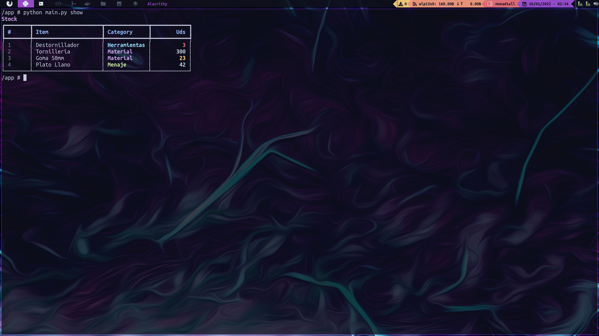

# py-stock

_Pequeña aplicación CLI desarrollada en Python para gestionar el control de stock de un almacén._



## Instalación :wrench:

_Estas instrucciones te permitirán obtener una copia del proyecto en funcionamiento en tu máquina local para propósitos de desarrollo y pruebas._

### Docker

_Instalar [Docker](https://docs.docker.com/engine/install/) en tu equipo._

_Levantar el contenedor con una terminal interactiva desde la que correr la aplicación._

```
docker build -t py-stock .
docker run -it --name py-stock --rm py-stock
```

## Uso :computer:

_Mostrar el stock actual:_

```
python main.py show 
```

_Nuevo item:_

```
python main.py new [NAME] [CATEGORY] [UDS]
```

_Añadir unidades:_

```
python main.py add [ID] [UDS]
```

_Restar unidades:_

```
python main.py sub [ID] [UDS]
```

_Borrar item:_

```
python main.py delete [ID]
```

_Mostrar el stock filtrado:_

```
python main.py show-filtered item [NAME]
python main.py show-filtered category [CATEGORY]
```

## Construido con :pencil:

* [Python](https://www.python.org/)
* [SQLite](https://www.sqlite.org/index.html) - Base de datos
* [Typer](https://typer.tiangolo.com/) - Librería de Python para construir aplicaciones CLI.
* [Rich](https://rich.readthedocs.io/en/stable/) - Librería de Python para escribir texto con formato en la terminal.

## Autor :alien:

* **Manu Valverde** - *Trabajo Inicial* - [Github](https://github.com/mavalverdecr)

## Licencia :scroll:

Este proyecto está bajo la Licencia (MIT) - mira el archivo [LICENSE.md](LICENSE.md) para detalles

---
⌨️ con ❤️ por [Manu Valverde](https://github.com/mavalverdecr) 😊
